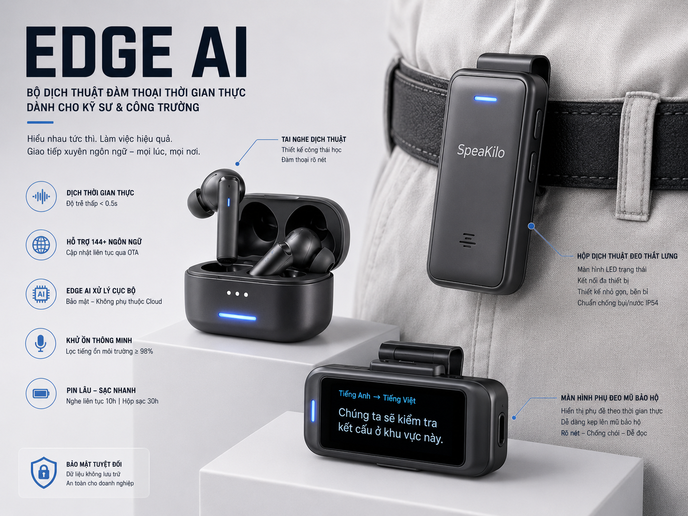

# OneVoice Edge

Local bilingual speech translation for the OneVoice AI Challenge.


<!-- Add device image -->


OneVoice Edge is designed as an offline, laptop-to-edge proof of concept:

```text
Mic frames
  -> streaming VAD endpointing
  -> denoise
  -> ASR
  -> text normalization
  -> envit5 machine translation
  -> live UI rendering
  -> optional queued TTS for committed translations
```

The default live pipeline keeps TTS silent for latency. Press **Voice** to
enable speech for each committed MT chunk; the control changes to **Silence**
and stops queued/current playback immediately. TTS prefetch stays outside the
ASR/MT critical path.

The default voices are male: `am_adam` for English output and `hung_thinh` for
Vietnamese output. The browser prepares the target-language runtime when Voice
is enabled or the translation direction changes.

## Competition Fit

The challenge rewards innovation, technical performance, and business viability. This repo is organized around those constraints:

- Offline runtime: models are loaded locally before the UI becomes ready.
- Low latency path: CTranslate2 INT8 envit5 is preferred when exported.
- Bidirectional language flow: `vi2en` and `en2vi` share one MT model.
- Edge-friendly structure: ASR, MT, VAD, TTS, web transport, and config are separated.
- Operational UI: full-screen spoken speech on the left, translation on the right, with retained transcript history.

## Project Layout

```text
config/
  config.yaml                  Runtime and model configuration
models/
  envit5-ct2-int8/             Optional CTranslate2 INT8 MT export
scripts/
  export_envit5_ct2.py         Export VietAI/envit5 to CTranslate2
  benchmark.py                 Local performance checks
app/
  onevoice/
    adapters/                  Compatibility adapters around ASR, MT, TTS, audio, subtitles
    config/                    Project-root aware config loader
    core/                      Shared event/result contracts
    realtime/                  Queue pipeline and streaming VAD
    web/                       FastAPI app, service layer, schemas, upload decoding
  audio/                       Existing low-level capture and denoise modules
  asr/                         GIPFormer and SenseVoice wrappers
  translation/                 envit5 translator with CT2 fallback
  tts/                         Optional TTS engines
  utils/                       Text, punctuation, subtitles, audio helpers
  web_static/                  Full-screen browser UI
```

`app/pipeline.py` and `app/web_app.py` are compatibility entrypoints. The production code lives under `app/onevoice/`.

## Setup

```powershell
conda activate onevoice
pip install -r requirements.txt
python scripts/export_sensevoice_onnx.py
.\scripts\setup_cuda_tts.ps1
```

For browser uploads and optional TTS, install FFmpeg and make sure it is available on `PATH`.

## Export envit5 to CTranslate2

The config already prefers `translation.backend: auto`, which uses CT2 when `models/envit5-ct2-int8/model.bin` exists and falls back to Transformers otherwise.

```powershell
conda activate onevoice
python scripts/export_envit5_ct2.py --quantization int8 --force
```

## Run the Local Web App

```powershell
conda activate onevoice
$env:PYTHONUTF8='1'
python -m uvicorn app.web_app:app --host 127.0.0.1 --port 8000
```

Open:

```text
http://127.0.0.1:8000
```

The app loads and warms up models during startup. `/api/status` reports readiness.

## Run the CLI Pipeline

```powershell
conda activate onevoice
$env:PYTHONUTF8='1'
python app/pipeline.py --direction vi2en
python app/pipeline.py --direction en2vi
```

## API Surface

- `GET /api/status`: model readiness and supported directions.
- `POST /api/translate-text`: text-only MT path.
- `POST /api/transcribe`: uploaded audio file through ASR -> MT.
- `POST /api/speak`: optional TTS for translated text.
- `WS /ws/stream`: live PCM16 microphone stream with server-side VAD endpointing.

## Edge Notes

- Use `models/envit5-ct2-int8` for the fastest CPU MT path.
- Use `models/sensevoice-small-onnx/model_quant.onnx` for EN input. The
  PyTorch-only `iic/SenseVoiceSmall` directory is not an ONNX runtime artifact.
- On the current RTX 3050 laptop, both Kokoro TTS directions use PyTorch CUDA.
  The CUDA setup script installs a matched PyTorch, TorchAudio, and TorchVision
  build while preserving the NumPy version required by SenseVoice.
- CTranslate2 MT and punctuation restoration remain on CPU so they can run in
  parallel without competing with latency-critical TTS for GPU memory.
- Vietnamese TTS keeps the fine-tuned Kokoro checkpoint to preserve voice
  quality until its custom ONNX export is separately evaluated.
- Keep `translation.beam_size: 1` for latency; raise it only for quality testing.
- VAD latency is controlled by `vad_window_ms`, `vad_min_silence_ms`, and `vad_pre_roll_ms`.
- The current ASR wrappers are segment-level. True token-level partial ASR should be the next technical upgrade if the competition hardware and model runtime allow it.
